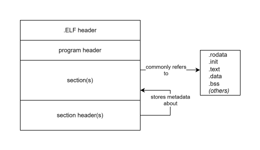

<div align="center">

# so-handling branch

</div>

The only purpose of this branch is to test and understand the `.ELF` parsing and reading strategy.
My thoughts and discoveries gonna be documented right bellow!

## Table of contents

- [the program's goal](#the-programs-goal)
  - [why does it matter?](#why-does-it-matter)
  - [the `acrt`'s features](#the-acrts-features)
- [how are `.so` files related to the `acrt` runtime?](#how-are-so-files-related-to-the-acrt-runtime)
  - [why not just compiling it into an executable?](#why-not-just-compiling-it-into-an-executable)
  - [how does `.so` solve this?](#how-does-so-solve-this)
- [resources](#resources)

## The program's goal

To talk about the `.so` file handling, I need to mention the program's goal!

The `acrt` program was designed to handle tiny test cases in C to check if your code is doing well.
I thought about turning C testing kinda simpler and delegating all the cases to an specified
controller!

TL;DR, the common testing implementation could be enforced by the compiler + preprocessing:

```c
#include <acrt.h>

TEST_CASE(test_mul) {
  ACRT_BOOL((2 * 2) > 3);
}

TEST_CASE(test_div) {
  ACRT_BOOL((2 / 2) == 1);
}
```

Instead of trivial copy, paste and flow managing:

```c
#include <stdio.h>
#include <assert.h>

int main(void) {
  int passed_count = 0;

  printf("testing mul.\n");
  assert((2 * 2) > 3);
  printf("passed!\n");
  passed_count++;

  printf("testing div.\n");
  assert((2 / 2) == 1);
  printf("passed!\n");
  passed_count++;

  printf("Tests passed: %d\n", passed_count);
  return 0;
}
```

### Why does it matter?

Test is a crucial part of software development. It purposes is to guarantee that what we've write
not only compiles but also does what it was expected to do!

Since C is a relatively low-level programming language, it doesn't provides extreme kind of
abstraction, forcing us to write long blocks of code which sometimes:
- isn't meaningful / easy-readable;
- repetitive _(avoidable by using **preprocessor**)_;
- is humanly _error-prone_ (commonly caused by the two topics above)

Passing the test responsibility to a dedicated entity can turn the test writing a more safe and
pleasurable experience.

### The `acrt`'s features

Here are the `acrt`'s main features:
- provide a meaningful test syntax + still valid C code:
  - easily achieved by using [C preprocessor macros](https://gcc.gnu.org/onlinedocs/cpp/Macros.html);
  - easy-readable by the developer + still valid for the compiler;
- take test cases as input and, well, run them.

To do so, the `acrt` framework must be separated in two different instances:
1. A library which provides the testing _syntax-sugar_;
2. A program _(binary)_ which works as runtime manager for the test cases input (mentioned at the
   previous list).

This documentation talks about (mainly) the test cases handling strategies.

## How are `.so` files related to the `acrt` runtime?

Since testing and assertion in general requires logical + instruction capacity, the runtime input
must be on a valid instruction-set format. In other words, independent machine code.

This can be achieved by compiling the test cases into a shared library object:
```sh
# 1. compile
gcc tests.c -shared -fPIC -o valid.so

# 2. run
acrt valid.so
```

With this approach:
- we separate the compilation from the runtime:
  - check if your code is valid, then, runs it.
- we avoid dealing with **high-abstracted** to **machine-code** data conversion:
  - there's no parsing from **this source** to **that thing**. Everything is an `.ELF` binary and
    can be easily loaded.
- we maintain the C compatibility:
  - your C code was invoked by a C source and machine-converted by a C compiler. There's no foreign
    actors.

Also, `.ELF` format is well documented on the man pages (also on the web) and can be easily handled
by using the `<elf.h>` API (check the [resources](#resources) subject).

### Why not just compiling it into an executable?

It would be nice if our test cases could just be compiled right to the final executable, but this
lead us to a problem which `acrt` was intended to solve:
- meaningful syntax;
- still valid C code;
- development ergonomics.

Consider the following test source:

```c
#include <assert.h>
#include <stdio.h>
#include <string.h>

int main() {
  // test case 1
  assert(1 == 2);

  // test case 2
  assert(strlen("ten chars?") == 10);

  puts("2 assertions passed!");
  return 0;
}
```

The `test case 2` will never be reached because `test case 1` assertion fails and aborts the
program. It's actually the main purpose of `assert` macro according with it's manual page:

> assert - abort the program if assertion is false

The problem is that we can't keep track of:
- how many assertions were done;
- how many assertions were passed/failed.

A good way to provide a better diagnostic is to shoot **single responsibility** functions and
`printf`s all the way:

```c
// ...

int test_is_even() {
  int numbers[] = {2, 4, 6};

  for (int i = 0; i < 3; i++) {
    if ((numbers[i] % 2) != 0) {
      return 0;
    }
  }

  return 1;
}

int test_is_ten_chars_long() {
  char *strings[] = { "ten chars?", "almost ten!" };

  for (int i = 0; i < 2; i++) {
    if (strlen(strings[i]) != 10) {
      return 0;
    }
  }

  return 1;
}

int main() {
  int exit_code = 0;

  if (test_is_even()) {
    puts("test_is_even: passed");
  } else {
    puts("test_is_even: failed");
    exit_code = 1;
  }

  if (test_is_ten_chars_long()) {
    puts("test_is_ten_chars_long: passed");
  } else {
    puts("test_is_ten_chars_long: failed");
    exit_code = 1;
  }

  return exit_code;
}
```

We gained multi-test diagnostic overview, but we lost writing ergonomics.

The last alternative is to write an array of case abstractions:

```c
// ...

typedef struct {
  const char *case_name;
  int (*test_func)(void);
} test_case_t;

const test_case_t TEST_CASES[] = {
  // name                     function
  { "test_is_even",           test_is_even           },
  { "test_is_ten_chars_long", test_is_ten_chars_long },
  { "test_is_positive",       test_is_positive       }

  // other cases...
};

const int TEST_CASE_COUNT = sizeof(TEST_CASES) / sizeof(test_case_t);

int main() {
  int exit_code = 0;

  for (int i = 0; i < TEST_CASE_COUNT; i++) {
    if (TEST_CASES[i].test_func()) {
      printf("%s: passed\n", TEST_CASES[i].case_name);
    } else {
      printf("%s: failed\n", TEST_CASES[i].case_name);
      exit_code = 1;
    }
  }

  return exit_code;
}
```

Everything goes well until:
- a function name changing;
- a new case adding;
- behavioral or structural changing (argument is required; returning `enum` value instead of `int`;
  `...`).

Also, using main function as manager force us to write a single testing runtime logic for each file
context:

```txt
test_connection.c
test_math.c
test_parsing.c
...
```

Compiling the source code into a shared library can turn our testing instances loadable by a
manager and ensure a consistent API, which mitigates exhaustive (and humanly error-prone)
implementation.

### How does `.so` solve this?

The found solution isn't delivered by the `.so` file itself. It's actually an `.ELF` feature!

When compiling a C source code, the output file format is defined by the target operating
system + the compiler toolchain:
- Windows compiles C to `.PE` and `.COFF` format
- Unix-like compiles C to `.ELF` format
- _and so on..._

The point is that since `.ELF` is a well structured format file, we can load, parse and execute
instructions at runtime!

<div align="center" id="elf-file-format-example-image">



_01 - `.ELF` file format example_

</div>

The elf file provides several sections. Each one refers to an specific proposal:
- `.rodata` refers to read-only data, such as string literals (aka `char *`);
- `.text` refers to machine code instructions;
- `...`

You can find out by using the `readelf` tool. First, write a C code:

```c
// main.c
#include <stdio.h>

int main(void) {
  char *w = "World";
  printf("Hello %s!\n", w);
  return 0;
}
```

Then, use `readelf` on the code's output:

```txt
$ gcc main.c -o main && readelf --sections main
There are 35 section headers, starting at offset 0x3f28:

Section Headers:
  [Nr] Name              Type             Address           Offset
       Size              EntSize          Flags  Link  Info  Align
  [ 0]                   NULL             0000000000000000  00000000
       0000000000000000  0000000000000000           0     0     0
  [ 1] .interp           PROGBITS         0000000000000318  00000318
       0000000000000019  0000000000000000   A       0     0     1
  [ 2] .note.gnu.pr[...] NOTE             0000000000000338  00000338
       0000000000000030  0000000000000000   A       0     0     8
...
```

Even better, we can look for string literals at `.rodata`, proving that different `.ELF` sections
targets specific purposes:

```txt
$ gcc main.c -o main && readelf --string-dump=.rodata main

String dump of section '.rodata':
  [     0]  World
  [     6]  Hello %s!\n

```

With this in mind, we can use the GCC's `__attribute__` macro, disposing code pieces within custom
sections! Again, we write a C code:

```c
// main.c
#include <stdio.h>

__attribute__((section(".custom_section")))
int custom_function() {
  return 42;
}

int main(void) {
  int custom_value = custom_function();
  printf("Hello %d!\n", custom_value);
  return 0;
}
```

Then, we compile + read it's `.ELF` data:

```txt
$ gcc main.c -o main && readelf --sections main | grep .custom_section
  [12] .custom_section   PROGBITS         00000000000011ba  000011ba
```

We can also confirms that the created `custom_function` is at `.custom_section` by using symbol
inspection:

```txt
$ readelf --symbols main
   Num:    Value          Size Type    Bind   Vis      Ndx Name
   ...
    23: 00000000000011ba    11 FUNC    GLOBAL DEFAULT   12 custom_function
                                                     +--^^
                                                     |
                          section index matches <----+
```

So, a custom section can store our specific scope functions, and later, be accessed by a dedicated
manager. These steps will be better explained at next subject!

## Resources

Resources that helped me during development/documentation:
- [draw.io](https://www.drawio.com/) for diagram drawing;
- [how to execute an object file](https://blog.cloudflare.com/how-to-execute-an-object-file-part-1/)
  at Cloudflare (by [Ignat Korchagin](https://blog.cloudflare.com/author/ignat/));
- `elf` manual pages disposed by my wsl (also available
  [here](https://man7.org/linux/man-pages/man5/elf.5.html));
- `dlinfo` manual pages disposed by my wsl (also available
  [here](https://www.man7.org/linux/man-pages/man3/dlinfo.3.html))
- `dl_iterate_phdr` manual pages disposed by my wsl (also available
  [here](https://man7.org/linux/man-pages/man3/dl_iterate_phdr.3.html));
- [elf format cheatsheet](https://gist.github.com/x0nu11byt3/bcb35c3de461e5fb66173071a2379779) by
  [x0nu11byt3](https://gist.github.com/x0nu11byt3);
- `readelf`  manual pages disposed by my wsl (also available
  [here](https://man7.org/linux/man-pages/man1/readelf.1.html)).
